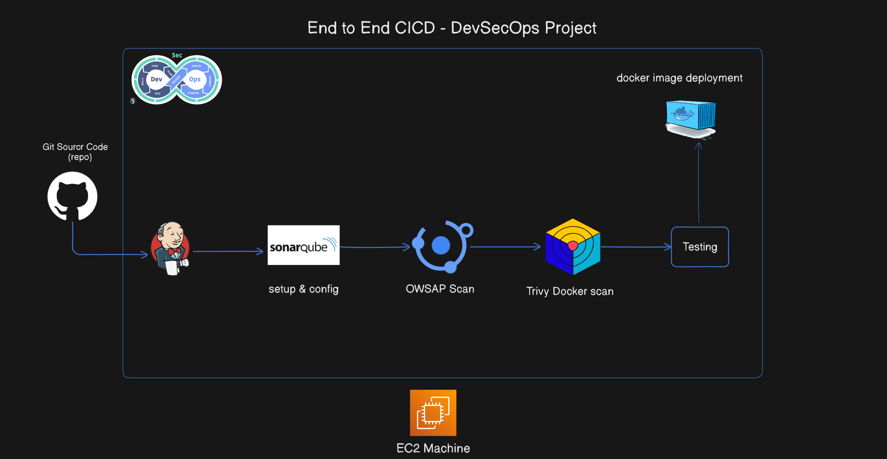

# End to End DevSecOps Project 

# Wanderlust - Your Ultimate Travel Blog 🌍✈️


WanderLust is a simple MERN travel blog website ✈ This project is aimed to help people to contribute in open source, upskill in react and also master git.


## Architecture Diagram 





## Steps by Step guidelines

Please do follow the below steps in order to execute this project.

```shell

1. EC2 Machine t2 large recommanded 

2. Connect ec2 machine

3. Clone Github wanderlust

4. Docker and docker-compose installation on ec2 machine

5. docker permission need to assigned

6. jenkins and java installation

7. connect of jenkins and login with password

8. run sonarsqube docker container (docker run -itd –name sonarsqube-server -p 9000:9000 sonarqube:lts-community)

9. To access sonarqube assign 9000 into Security Group

10. Access SonarQube Server <ip>:9000

11. Now we need to connect sonarqube to jenkins and jenkins to sonarqube for code scanner using webhook

12. Trivy Installation (sudo apt-get install wget apt-transport-https gnupg lsb-release

wget -qO - https://aquasecurity.github.io/trivy-repo/deb/public.key | sudo apt-key add -

echo deb https://aquasecurity.github.io/trivy-repo/deb $(lsb_release -sc) main | sudo tee -a /etc/apt/sources.list.d/trivy.list

sudo apt-get update

sudo apt-get install trivy

13. sudo apt update (system update)

14.now goto jenkins → manage jenkins → plugins

15. install sonarqube scanner

16. install sonarQuality gates

17. OWSAP Dependency check

18. docker

19. restart jenkins

20 now integrate with jenkins and sonarQube

21. goto sonarQube server <ip>:9000 and login (goto adminitation- >  configuration - > webhooks - > create button → name<jenkins>, url<jenkins url>:8080/
sonarqube-webhook/ and then click create button

22. goto security → users → see tokens and click and generate token - > put some name <admin> and click <generate button>

23. copy tocken <token-copy>  squ_a94f410ebe969ecc92e5f39c63fe148ada5e7796

24. goto jenkins → manage jenkins → system → look Sonarqube server → Add SonarQube button → Name <sonar>, Sonarqube URL<url>:9000, add token <token> via credentails 
and click save button

25. goto manage jenkins → Tools → goto SonarQube scanner installation → add name <sonar>, select version and click save button

26. goto manage jenkins → tools → Dependency Check → Add → add name<dc>, check install automatically →  install github.com → select dependency version → then click 
save button

27. Now create pipeline → goto jenkins piple and select Pipeline → and click create button.

28. then check the Github project - > and <put github project Url>

29 check Github hoot trigger ….

30 Now goto pipeline scrip and write code →
 
 
 Pipeline Code 

pipeline{
    agent any
    environment{
        SONAR_HOME= tool "Sonar"
    }
    stages{
        stage("Clone Code from GitHub"){
            steps{
                git url: "https://github.com/waseemuddin/DevSecOps-Project.git", branch: "devops"
            }
        }
        stage("SonarQube Quality Analysis"){
            steps{
                withSonarQubeEnv("Sonar"){
                    sh "$SONAR_HOME/bin/sonar-scanner -Dsonar.projectName=wanderlust -Dsonar.projectKey=wanderlust"
                }
            }
        }
        stage("OWASP Dependency Check"){
            steps{
                dependencyCheck additionalArguments: '--scan ./', odcInstallation: 'dc'
                dependencyCheckPublisher pattern: '**/dependency-check-report.xml'
            }
        }
        stage("Sonar Quality Gate Scan"){
            steps{
                timeout(time: 2, unit: "MINUTES"){
                    waitForQualityGate abortPipeline: false
                }
            }
        }
        stage("Trivy File System Scan"){
            steps{
                sh "trivy fs --format  table -o trivy-fs-report.html ."
            }
        }
        stage("Deploy using Docker compose"){
            steps{
                sh "docker-compose up -d"
            }
        }
    }
}
